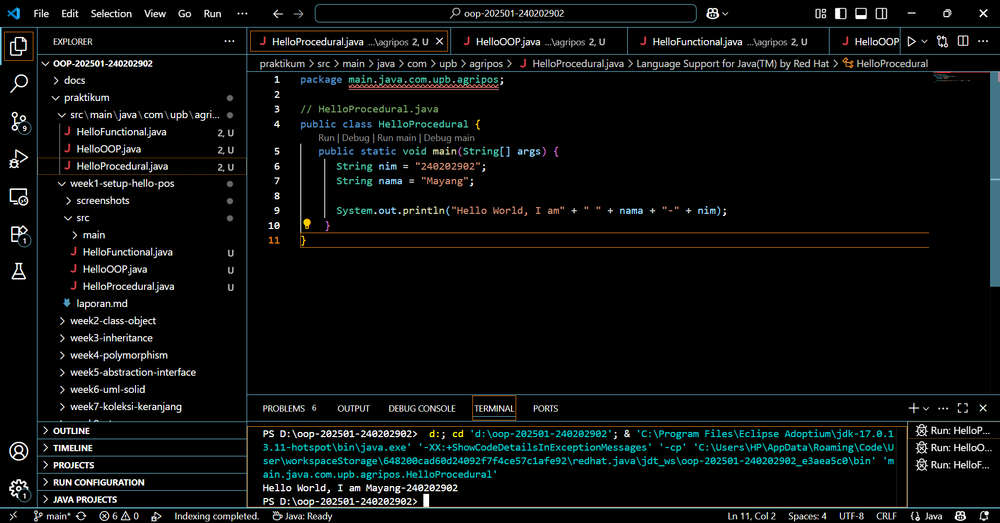
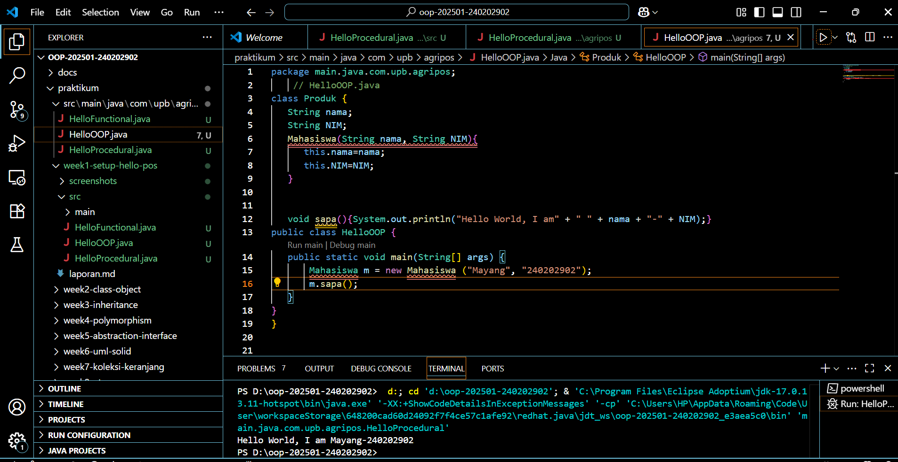
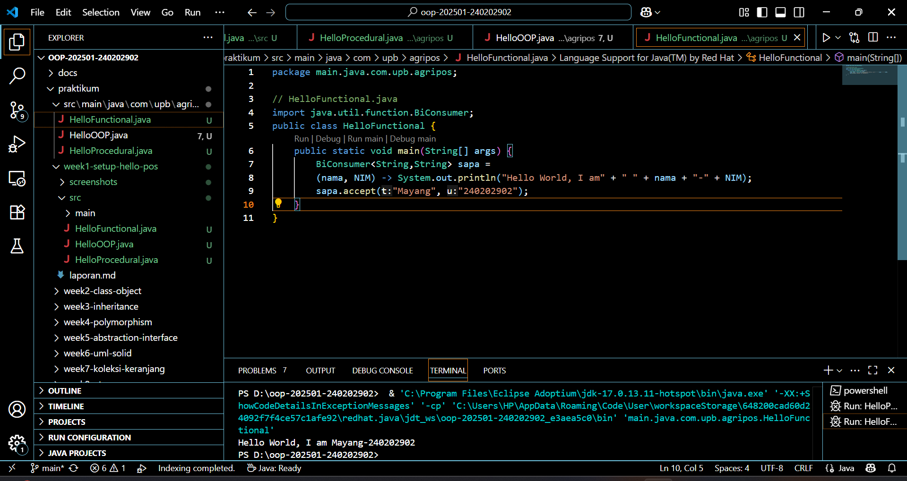

# Laporan Praktikum Minggu 1 (sesuaikan minggu ke berapa?)
Topik: ["Paradigma dan Setup"]

## Identitas
- Nama  : Mayang Nur Annisa Kusuma
- NIM   : 240202902
- Kelas : 3IKRB

---

## Tujuan
Mahasiswa mampu mendefinisikan paradigma prosedural, OOP, dan fungsional.
Mahasiswa mampu membandingkan kelebihan dan keterbatasan tiap paradigma.
Mahasiswa mampu memberikan contoh program sederhana untuk masing-masing paradigma.
Mahasiswa aktif dalam diskusi kelas (bertanya, menjawab, memberi opini).

---

## Dasar Teori
Tuliskan ringkasan teori singkat (3–5 poin) yang mendasari praktikum

Prosedural: program dibangun sebagai rangkaian perintah (fungsi/prosedur).
OOP (Object-Oriented Programming): program dibangun dari objek yang memiliki data (atribut) dan perilaku (method).
Fungsional: program dipandang sebagai pemetaan fungsi matematika, lebih menekankan ekspresi dan transformasi data.
Dalam konteks Agri-POS, OOP membantu memodelkan entitas nyata seperti Produk, Transaksi, dan Pembayaran sebagai objek. Dengan demikian, sistem lebih mudah dikembangkan dan dipelihara.

---

## Langkah Praktikum
1. Setup Project

   Pastikan sudah menginstall JDK (Java Development Kit), IDE (misal: IntelliJ IDEA, VS Code, NetBeans), Git, PostgreSQL, dan JavaFX di komputer.
   Buat folder project oop-pos-<nim>.
   Inisialisasi repositori Git.
   Buat struktur awal src/main/java/com/upb/agripos/.
   Pastikan semua tools dapat berjalan (uji dengan membuat dan menjalankan program Java sederhana).
   Program Sederhana dalam 3 Paradigma

2. Prosedural: program untuk menghitung total harga dua produk.
   OOP: class Produk dengan atribut nama dan harga, buat minimal tiga objek, lalu hitung total.
   Fungsional: gunakan Stream atau lambda untuk menghitung total harga dari minimal tiga objek.

3. Commit dan Push
   Commit dengan pesan: week1-setup-hello-pos.

---

## Kode Program

1. Procedural
```
// HelloProcedural.java
public class HelloProcedural {
   public static void main(String[] args) {
      String nim = "240202902";
      String nama = "Mayang";
      
      System.out.println("Hello World, I am" + " " + nama + "-" + nim);
   }
}
```

2. OOP
```
// HelloOOP.java
class Mahasiswa {
   String nama;
   String NIM;
   Mahasiswa(String nama, String NIM) {
      this.nama = nama;
      this.NIM = NIM;
   }
   void sapa(){ System.out.println("Hello World, I am" + " " + nama + "-" + NIM);}
}

public class HelloOOP {
   public static void main(String[] args) {
       Mahasiswa m = new Mahasiswa ("Mayang", "240202902");
       m.sapa();
   }
}
```

3. Functional
```
// HelloFunctional.java
import java.util.function.BiConsumer;
public class HelloFunctional {
    public static void main(String[] args) {
        BiConsumer<String,String> sapa =
        (nama, NIM) -> System.out.println("Hello World, I am" + " " + nama + "-" + NIM);
        sapa.accept("Mayang", "240202902");
    }
}
```

## Hasil Eksekusi
Sertakan screenshot hasil eksekusi program.  
1. 
2. 
3. 

---

## Analisis

- Jelaskan bagaimana kode berjalan.  
1. Prosedural
   Kode berjalan secara berurutan dari atas ke bawah di dalam satu fungsi utama (main). Semua data dan logika berada dalam satu blok kode. Misalnya, perulangan untuk menghitung total harga dilakukan langsung di dalam main.
2. OOP (Object-Oriented Programming)
   Program terdiri dari kelas dan objek.
   Di sini dibuat kelas Produk dengan atribut nama dan harga. Objek-objek produk dibuat dari kelas ini, lalu diproses dalam perulangan untuk menghitung total harga.
   OOP membuat kode lebih terstruktur dan mudah dikembangkan karena setiap entitas (produk, transaksi, dsb) dapat direpresentasikan sebagai objek.
3. Fungsional
   Pendekatan ini menggunakan ekspresi dan fungsi (bukan objek atau prosedur utama) untuk mengolah data.
   Contohnya, Stream digunakan untuk menghitung total harga dengan mapToInt().sum() tanpa perlu loop manual. Paradigma ini fokus pada transformasi data, bukan urutan langkah.

- Kendala yang dihadapi dan cara mengatasinya.
  Beberapa bagian kode sempat mengalami error, terutama pada deklarasi variabel dan struktur perulangan yang kurang tepat. Selain itu, terjadi kesalahan import library pada program fungsional karena penulisan paket belum sesuai. Kendala lain juga muncul saat memastikan program dapat dijalankan di semua file (HelloProcedural, HelloOOP, dan HelloFunctional). Setelah dilakukan pengecekan ulang terhadap sintaks, struktur folder, serta penyesuaian nama kelas dan package, seluruh program akhirnya dapat berjalan dengan baik tanpa error.

---

## Kesimpulan

Setiap paradigma pemrograman memiliki cara berbeda dalam menyusun solusi: prosedural fokus pada langkah-langkah logis, OOP pada objek dan struktur yang terorganisir, serta fungsional pada transformasi data yang ringkas.Pemahaman ketiganya membantu memilih pendekatan yang paling sesuai dengan kebutuhan pengembangan program.
---

## Quiz
1. Apakah OOP selalu lebih baik dari prosedural?
   Jawab:
   Tidak selalu. OOP lebih baik untuk sistem besar dan kompleks yang butuh modularitas dan pemeliharaan jangka panjang.
   Namun, untuk program kecil atau tugas sederhana, paradigma prosedural lebih efisien karena lebih cepat ditulis dan lebih ringan.
2. Kapan functional programming lebih cocok digunakan dibanding OOP atau prosedural?
   Jawab
   Paradigma fungsional lebih cocok digunakan ketika program membutuhkan banyak manipulasi data atau perhitungan matematis, misalnya data processing, stream computation, atau concurrent system.
   Fungsional membantu menulis kode yang ringkas, aman dari efek samping, dan mudah diuji.
3. Bagaimana paradigma (prosedural, OOP, fungsional) memengaruhi maintainability dan scalability      aplikasi?
   Jawab:
   a. Prosedural: mudah dibuat, tetapi sulit diperluas dan dirawat karena logika bercampur dalam satu   blok kode.
   b. OOP: sangat mendukung maintainability dan scalability karena kode terstruktur dalam kelas dan objek yang bisa diwariskan dan dimodifikasi.
   c. Fungsional: mudah dipelihara karena bebas efek samping dan setiap fungsi berdiri sendiri, tetapi butuh pola pikir berbeda dari OOP.
4. Mengapa OOP lebih cocok untuk mengembangkan aplikasi POS dibanding prosedural?
   Jawab:
   Karena aplikasi POS (Point of Sale) melibatkan banyak entitas nyata seperti Produk, Pelanggan, Transaksi, dan Pembayaran.
   Dengan OOP, setiap entitas bisa dimodelkan sebagai objek yang memiliki atribut dan perilaku sendiri, sehingga sistem menjadi modular, mudah dikembangkan, dan lebih mudah ditambahkan fitur baru.
5. Bagaimana paradigma fungsional dapat membantu mengurangi kode berulang (boilerplate code)?
   Jawab:
   Paradigma fungsional menggunakan ekspresi seperti lambda, map, filter, dan reduce untuk melakukan operasi kompleks tanpa menulis loop atau variabel tambahan.
   Dengan begitu, kode menjadi lebih ringkas, deklaratif, dan fokus pada apa yang dilakukan, bukan bagaimana melakukannya.