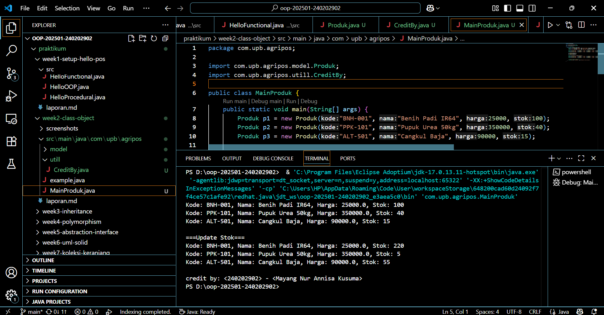

# Laporan Praktikum Minggu 1 (sesuaikan minggu ke berapa?)
Topik: [Tuliskan judul topik, misalnya "Class dan Object"]

## Identitas
- Nama  : [Mayang Nur Annisa Kusuma]
- NIM   : [240202902]
- Kelas : [3IKRB]

---

## Tujuan
Mahasiswa mampu menjelaskan konsep class, object, atribut, dan method dalam OOP.
Mahasiswa mampu menerapkan access modifier dan enkapsulasi dalam pembuatan class.
Mahasiswa mampu mengimplementasikan class Produk pertanian dengan atribut dan method yang sesuai.
Mahasiswa mampu mendemonstrasikan instansiasi object serta menampilkan data produk pertanian di console.
Mahasiswa mampu menyusun laporan praktikum dengan bukti kode, hasil eksekusi, dan analisis sederhana.
---

## Dasar Teori
Class adalah blueprint atau cetak biru dari sebuah objek. Objek merupakan instansiasi dari class yang berisi atribut (data) dan method (perilaku). Dalam OOP, enkapsulasi dilakukan dengan menyembunyikan data menggunakan access modifier (public, private, protected) serta menyediakan akses melalui getter dan setter.

Dalam konteks Agri-POS, produk pertanian seperti benih, pupuk, dan alat pertanian dapat direpresentasikan sebagai objek yang memiliki atribut nama, harga, dan stok. Dengan menggunakan class, setiap produk dapat dibuat, dikelola, dan dimanipulasi secara lebih terstruktur.

---

## Langkah Praktikum
1. Membuat Class Produk
   a. Buat file Produk.java pada package model.
   b. Tambahkan atribut: kode, nama, harga, dan stok.
   c. Gunakan enkapsulasi dengan menjadikan atribut bersifat private dan membuat getter serta    setter untuk masing-masing atribut.

2. Membuat Class CreditBy
   Buat file CreditBy.java pada package util.
   Isi class dengan method statis untuk menampilkan identitas mahasiswa di akhir output: credit by: <NIM> - <Nama>.

3. Membuat Objek Produk dan Menampilkan Credit
   Buat file MainProduk.java.
   Instansiasi minimal tiga objek produk, misalnya "Benih Padi", "Pupuk Urea", dan satu produk alat pertanian.
   Tampilkan informasi produk melalui method getter.
   Panggil CreditBy.print("<NIM>", "<Nama>") di akhir main untuk menampilkan identitas.
4. Commit dan Push
   Commit dengan pesan: week2-class-object.
---

## Kode Program

```
package com.upb.agripos;

import com.upb.agripos.model.Produk;
import com.upb.agripos.utill.CreditBy;

public class MainProduk {
    public static void main(String[] args) {
        Produk p1 = new Produk("BNH-001", "Benih Padi IR64", 25000, 100);
        Produk p2 = new Produk("PPK-101", "Pupuk Urea 50kg", 350000, 40);
        Produk p3 = new Produk("ALT-501", "Cangkul Baja", 90000, 15);

        System.out.println("Kode: " + p1.getKode() + ", Nama: " + p1.getNama() + ", Harga: " + p1.getHarga() + ", Stok: " + p1.getStok());
        System.out.println("Kode: " + p2.getKode() + ", Nama: " + p2.getNama() + ", Harga: " + p2.getHarga() + ", Stok: " + p2.getStok());
        System.out.println("Kode: " + p3.getKode() + ", Nama: " + p3.getNama() + ", Harga: " + p3.getHarga() + ", Stok: " + p3.getStok());

        p1.tambahStok(120);
        p2.kurangiStok(35);
        p3.tambahStok(40);

        System.out.println("\n===Update Stok===");
        System.out.println("Kode: " + p1.getKode() + ", Nama: " + p1.getNama() + ", Harga: " + p1.getHarga() + ", Stok: " + p1.getStok());
        System.out.println("Kode: " + p2.getKode() + ", Nama: " + p2.getNama() + ", Harga: " + p2.getHarga() + ", Stok: " + p2.getStok());
        System.out.println("Kode: " + p3.getKode() + ", Nama: " + p3.getNama() + ", Harga: " + p3.getHarga() + ", Stok: " + p3.getStok());


        // Tampilkan identitas mahasiswa
        CreditBy.print("<240202902>", "<Mayang Nur Annisa Kusuma>");
    }
}
```

---

## Hasil Eksekusi 


---

## Analisis

- Jelaskan bagaimana kode berjalan.  
   File yang dijalankan adalah MainProduk.java, yang berada di package com.upb.agripos.
      Kode ini berfungsi untuk:
      Membuat objek produk dari class Produk (yang ada di model/Produk.java).
      Menampilkan data produk (kode, nama, harga, stok).
      Melakukan update stok melalui method tertentu di class Produk.
      Menampilkan hasil perubahan stok setelah di-update.
      Ada juga pemanggilan CreditBy.java, yang mungkin menampilkan informasi pembuat program.Alur eksekusi sederhananya:
      Program dimulai dari main() di MainProduk.java.
      Tiga objek dibuat
      Masing-masing objek menyimpan data di dalam atributnya (kode, nama, harga, stok).
      Program menampilkan data awal produk (pakai System.out.println atau toString()).
      Stok produk diubah (misalnya lewat method seperti tambahStok() atau kurangStok()).
      Program menampilkan ulang daftar produk setelah stok diperbarui.
      Akhirnya muncul kredit pembuat program
- Apa perbedaan pendekatan minggu ini dibanding minggu sebelumnya.  
   Pada minggu pertama, pendekatan yang digunakan masih bersifat procedural atau functional, di mana seluruh kode ditulis dalam satu file dan dijalankan melalui fungsi-fungsi statis di dalam method main(). Belum ada pemisahan antara data dan perilaku, sehingga belum menggunakan konsep class dan object secara penuh.

   Sedangkan pada minggu kedua, pendekatan yang digunakan sudah menerapkan Object-Oriented Programming (OOP). Program mulai menggunakan class Produk sebagai blueprint (template) dan object p1, p2, p3 sebagai instance dari class tersebut. Selain itu, data dan method sudah dienkapsulasi di dalam class, serta terdapat pemisahan struktur package seperti model dan utill agar kode lebih terorganisir.
- Kendala yang dihadapi dan cara mengatasinya.  
   Selama praktikum, beberapa kendala umum yang muncul antara lain:
   Error “cannot find symbol” saat memanggil class, biasanya terjadi karena struktur package belum sesuai atau import belum benar. Solusinya adalah memastikan struktur folder dan deklarasi package di awal file sesuai, misalnya package com.upb.agripos.model;, serta menggunakan import yang tepat di file utama.
   Program tidak bisa dijalankan, karena tidak ada method main() atau file dijalankan dari folder yang salah. Untuk mengatasinya, jalankan file utama MainProduk.java yang memiliki public static void main(String[] args).
   Output tidak muncul, biasanya disebabkan oleh tidak adanya pemanggilan System.out.println() atau method belum mengembalikan nilai yang diharapkan. Solusinya adalah menambahkan perintah cetak atau memastikan method toString() di class Produk sudah di-override dengan benar.Masalah saat update stok, misalnya stok menjadi negatif akibat kesalahan logika pada method. Solusinya adalah menambahkan validasi pada setter atau method update

---

## Kesimpulan
Pendekatan minggu ini jauh lebih terstruktur dan “nyata” dibanding minggu sebelumnya karena sudah berorientasi pada objek. Mulai berpikir seperti mendesain sistem dunia nyata di dalam kode.
---

## Quiz
Mengapa atribut sebaiknya dideklarasikan sebagai private dalam class?
   Jawaban:Atribut sebaiknya dideklarasikan sebagai private supaya data di dalam class tidak bisa diakses atau diubah langsung dari luar class.
   Tujuannya:
   Melindungi data (data hiding): mencegah perubahan sembarangan yang bisa merusak konsistensi data.
   Kontrol akses: hanya method tertentu (getter/setter) yang boleh membaca atau mengubah data.Menjaga integritas objek: misalnya, stok produk tidak boleh negatif, atau harga tidak boleh nol — hal itu bisa dicegah lewat validasi di setter.

Apa fungsi getter dan setter dalam enkapsulasi?
   Jawaban:getter dan setter berfungsi sebagai jembatan aman antara atribut privat dengan dunia luar (class lain).
   Getter: digunakan untuk mengambil (membaca) nilai atribut.
   Setter: digunakan untuk mengubah (menulis) nilai atribut, biasanya dengan validasi.

Bagaimana cara class Produk mendukung pengembangan aplikasi POS yang lebih kompleks?
   Jawaban:Class Produk berperan sebagai representasi dasar dari barang di sistem Point of Sale (POS).
   Dengan desain OOP, class ini bisa diperluas, dimodifikasi, dan digunakan kembali tanpa mengubah kode utama.
   Contohnya:
   Bisa dibuat class turunan seperti ProdukMakanan, ProdukElektronik, atau ProdukPertanian dengan atribut tambahan (kadaluarsa, garansi, dsb).
   Bisa ditambah fitur baru seperti diskon, kategori produk, atau manajemen stok otomatis.
   Dapat digunakan bersama class lain seperti Transaksi, Kasir, atau Customer untuk membangun sistem POS yang lengkap.
   Mempermudah maintenance dan kolaborasi, karena tiap class punya tanggung jawabnya sendiri (sesuai prinsip SOLID).
