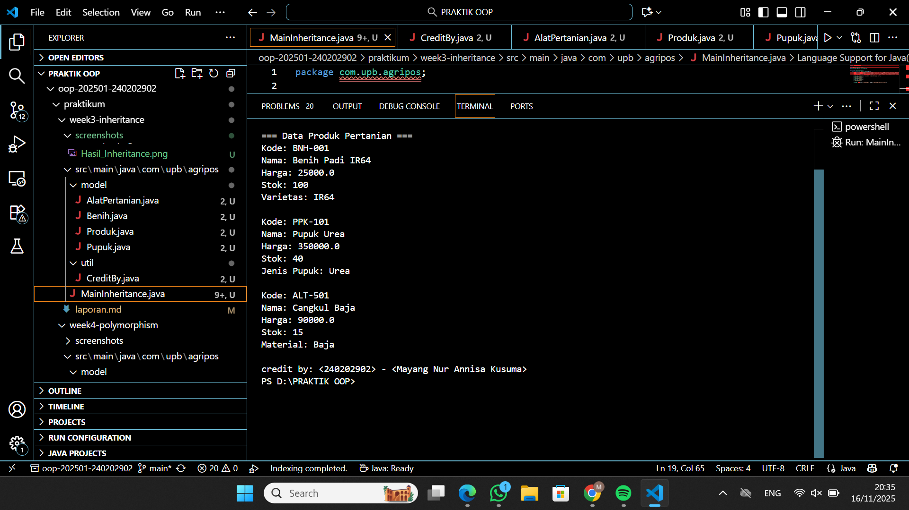

# Laporan Praktikum Minggu 1 (sesuaikan minggu ke berapa?)
Topik: [Inheritance (Kategori Produk)]

## Identitas
- Nama  : [Mayang Nur Annisa Kusuma]
- NIM   : [240202902]
- Kelas : [3IKRB]

---

## Tujuan
1. Mahasiswa mampu menjelaskan konsep inheritance (pewarisan class) dalam OOP.
2, Mahasiswa mampu membuat superclass dan subclass untuk produk pertanian.
3. Mahasiswa mampu mendemonstrasikan hierarki class melalui contoh kode.
4. Mahasiswa mampu menggunakan super untuk memanggil konstruktor dan method parent class.
5. Mahasiswa mampu membuat laporan praktikum yang menjelaskan perbedaan penggunaan inheritance dibanding class tunggal.


---

## Dasar Teori
Inheritance adalah mekanisme dalam OOP yang memungkinkan suatu class mewarisi atribut dan method dari class lain.
a. Superclass: class induk yang mendefinisikan atribut umum.
b. Subclass: class turunan yang mewarisi atribut/method superclass, dan dapat menambahkan atribut/method baru.
c. super digunakan untuk memanggil konstruktor atau method superclass.
Dalam konteks Agri-POS, kita dapat membuat class Produk sebagai superclass, kemudian Benih, Pupuk, dan AlatPertanian sebagai subclass. Hal ini membuat kode lebih reusable dan terstruktur.

---

## Langkah Praktikum
1. Membuat Superclass Produk
   Gunakan class Produk dari Bab 2 sebagai superclass.
2. Membuat Subclass
   a. Benih.java → atribut tambahan: varietas.
   b. Pupuk.java → atribut tambahan: jenis pupuk (Urea, NPK, dll).
   c. AlatPertanian.java → atribut tambahan: material (baja, kayu, plastik).
3. Membuat Main Class
   a. Instansiasi minimal satu objek dari tiap subclass.
   b. Tampilkan data produk dengan memanfaatkan inheritance.
4. Menambahkan CreditBy
   Panggil class CreditBy untuk menampilkan identitas mahasiswa.
5. Commit dan Push
   Commit dengan pesan: week3-inheritance.

---

## Kode Program
1. Benih.java
```
package com.upb.agripos.model;

public class Benih extends Produk {
    private String varietas;

    public Benih(String kode, String nama, double harga, int stok, String varietas) {
        super(kode, nama, harga, stok);
        this.varietas = varietas;
    }

    public String getVarietas() { return varietas; }
    public void setVarietas(String varietas) { this.varietas = varietas; }
}
```
2. Pupuk.java
```
package com.upb.agripos.model;

public class Pupuk extends Produk {
    private String jenis;

    public Pupuk(String kode, String nama, double harga, int stok, String jenis) {
        super(kode, nama, harga, stok);
        this.jenis = jenis;
    }

    public String getJenis() { return jenis; }
    public void setJenis(String jenis) { this.jenis = jenis; }
}
```
3. AlatPertanian.java
```
package com.upb.agripos.model;

public class AlatPertanian extends Produk {
    private String material;

    public AlatPertanian(String kode, String nama, double harga, int stok, String material) {
        super(kode, nama, harga, stok);
        this.material = material;
    }

    public String getMaterial() { return material; }
    public void setMaterial(String material) { this.material = material; }
}
```
4. MainInheritance.java
```
package com.upb.agripos;

import com.upb.agripos.model.*;
import com.upb.agripos.util.CreditBy;

public class MainInheritance {
    public static void main(String[] args) {
        Benih b = new Benih("BNH-001", "Benih Padi IR64", 25000, 100, "IR64");
        Pupuk p = new Pupuk("PPK-101", "Pupuk Urea", 350000, 40, "Urea");
        AlatPertanian a = new AlatPertanian("ALT-501", "Cangkul Baja", 90000, 15, "Baja");

        System.out.println("Benih: " + b.getNama() + " Varietas: " + b.getVarietas());
        System.out.println("Pupuk: " + p.getNama() + " Jenis: " + p.getJenis());
        System.out.println("Alat Pertanian: " + a.getNama() + " Material: " + a.getMaterial());

        CreditBy.print("<NIM>", "<Nama Mahasiswa>");
    }
}
```

---

## Hasil Eksekusi


---

## Analisis
1. Jelaskan bagaimana kode berjalan.
    Program Week 3 berjalan menggunakan konsep inheritance (pewarisan).
    Kelas utama bernama Produk berfungsi sebagai parent class yang menyimpan atribut umum seperti kode, nama, harga, dan stok.
    Kemudian terdapat tiga child class yang mewarisi atribut tersebut:
    a. Benih → menambahkan atribut varietas
    b. Pupuk → menambahkan atribut jenis
    c. AlatPertanian → menambahkan atribut material
    Saat program dijalankan, method main membuat objek dari masing-masing class tersebut.
    Constructor setiap class turunan memanggil super(...) untuk mengisi atribut dari Produk, lalu mengisi atribut khusus mereka sendiri.
    Selanjutnya, program menampilkan data objek melalui getter yang berasal dari Produk maupun class turunannya.
    Bagian akhir program menampilkan identitas pembuat menggunakan class CreditBy.
    Dengan inheritance, kode menjadi lebih rapi karena class produk tidak perlu menulis ulang atribut yang sama.
2. Apa perbedaan pendekatan minggu ini dibanding minggu sebelumnya.
    Pendekatan minggu ini menggunakan inheritance, sedangkan minggu sebelumnya masih menggunakan class terpisah tanpa hubungan antar class.
    Perbedaan utamanya:
    Minggu Sebelumnya:
    Class masih berdiri sendiri, semua atribut ditulis di masing-masing class → banyak duplikasi kode.
    Minggu Ini (Inheritance):
    Atribut dan method umum disatukan di parent class Produk
    Class turunan hanya menambah atribut khusus
    Struktur kode lebih rapi, modular, mudah dikembangkan
    Mengurangi penulisan kode berulang
    Dengan pewarisan, program mengikuti konsep OOP dengan lebih baik dan lebih efisien.
3. Kendala yang dihadapi dan cara mengatasinya.
    Beberapa kendala yang muncul selama pengerjaan:
    a. File berada di folder yang salah
        Awalnya file ditempatkan di folder Week 4, bukan Week 3, sehingga muncul error seperti
        “Benih cannot be resolved to a type”.
        Solusi:
        Memindahkan file ke struktur folder Week 3 yang benar.
    b. VS Code masih membaca workspace lama
        Akibatnya classpath salah dan program tetap membaca project sebelumnya.
        Solusi:
        Menutup VS Code, membuka folder Week 3 secara terpisah, dan menjalankan ulang build.
    c. Package tidak sesuai struktur folder
        Beberapa file memiliki deklarasi package yang tidak cocok dengan lokasi file.
        Solusi:
        Menyesuaikan package setiap file dengan foldernya, misalnya:
        package com.upb.agripos.model;
    d. Output duplikat / class lama masih terbaca
        Karena file lama masih tersisa.
        Solusi:
        Menghapus file lama dan memastikan hanya file Week 3 yang digunakan.
---

## Kesimpulan
Pada praktikum minggu ini, konsep inheritance berhasil diterapkan untuk membangun hierarki class pada sistem Agri-POS. Dengan menjadikan Produk sebagai superclass dan membuat subclass seperti Benih, Pupuk, dan AlatPertanian, kode menjadi lebih terstruktur, mudah dirawat, dan tidak terjadi duplikasi atribut maupun method. Penggunaan super() juga memastikan bahwa setiap subclass dapat memanfaatkan constructor dari superclass secara efektif.

---

## Quiz
1. Apa keuntungan menggunakan inheritance dibanding membuat class terpisah tanpa hubungan? 
   **Jawaban:** 
    Keuntungan utama penggunaan inheritance adalah mengurangi duplikasi kode dan membuat struktur program lebih rapi.
    Dengan inheritance:
    a. Atribut dan method umum cukup ditulis sekali di superclass.
    b. Subclass otomatis mewarisi kode tersebut tanpa menulis ulang.
    c. Program lebih mudah dikelola dan dikembangkan.
    d. Perubahan di superclass otomatis berlaku untuk semua subclass.
    e. Relasi antar class menjadi jelas karena menunjukkan hierarki objek.
    Jika class dibuat terpisah tanpa hubungan, setiap class harus menulis ulang atribut dan method yang sama, sehingga rawan error, sulit dirawat, dan kurang efisien.
2. Bagaimana cara subclass memanggil konstruktor superclass?
   **Jawaban:**
    Subclass memanggil konstruktor superclass menggunakan keyword super(...) pada baris pertama constructor subclass.
    Parameter di dalam super() harus sesuai dengan constructor yang ada di superclass
3. Berikan contoh kasus di POS pertanian selain Benih, Pupuk, dan Alat Pertanian yang bisa dijadikan subclass. 
   **Jawaban:** 
    Beberapa contoh produk pertanian lain yang bisa dijadikan subclass dari Produk, misalnya:
    a. ObatHama
    Atribut khusus: jenis racun, dosis pemakaian.
    b. BibitHewan
    Atribut khusus: jenis hewan, umur bibit.
    c. Pestisida
    Atribut khusus: tipe pestisida, komposisi bahan aktif.
    d. PakanTernak
    Atribut khusus: jenis pakan, berat per kemasan.
    e. VitaminTanaman
    Atribut khusus: kandungan nutrisi, cara aplikasi.
    Semua contoh di atas tetap memiliki atribut umum Produk (kode, nama, harga, stok), sehingga cocok dijadikan subclass.