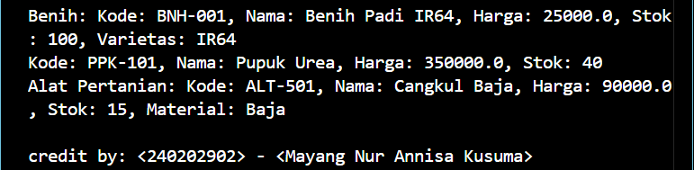

# Laporan Praktikum Minggu 4 
Topik: Polymorphism (Info Produk)

## Identitas
- Nama  : [Mayang Nur Annisa Kusuma]
- NIM   : [240202902]
- Kelas : [3IKRB]

---

## Tujuan
a. Mahasiswa mampu menjelaskan konsep polymorphism dalam OOP.
b. Mahasiswa mampu membedakan method overloading dan overriding.
c. Mahasiswa mampu mengimplementasikan polymorphism (overriding, overloading, dynamic binding) dalam program.
d. Mahasiswa mampu menganalisis contoh kasus polymorphism pada sistem nyata (Agri-POS).
---

## Dasar Teori
Polymorphism berarti “banyak bentuk” dan memungkinkan objek yang berbeda merespons panggilan method yang sama dengan cara yang berbeda.

   1. Overloading → mendefinisikan method dengan nama sama tetapi parameter berbeda.
   2. Overriding → subclass mengganti implementasi method dari superclass.
   3. Dynamic Binding → pemanggilan method ditentukan saat runtime, bukan compile time.

Dalam konteks Agri-POS, misalnya:
   a. Method getInfo() pada Produk dioverride oleh Benih, Pupuk, AlatPertanian untuk menampilkan detail spesifik.
   b. Method tambahStok() bisa dibuat overload dengan parameter berbeda (int, double).
---

## Langkah Praktikum
1. Overloading
   Tambahkan method tambahStok(int jumlah) dan tambahStok(double jumlah) pada class Produk.

2. Overriding
   Tambahkan method getInfo() pada superclass Produk.
   Override method getInfo() pada subclass Benih, Pupuk, dan AlatPertanian.

3. Dynamic Binding
   Buat array Produk[] daftarProduk yang berisi objek Benih, Pupuk, dan AlatPertanian.
   Loop array tersebut dan panggil getInfo(). Perhatikan bagaimana Java memanggil method sesuai jenis objek aktual.

4. Main Class
   Buat MainPolymorphism.java untuk mendemonstrasikan overloading, overriding, dan dynamic binding.
5. CreditBy
   Tetap panggil CreditBy.print("<NIM>", "<Nama>").
6. Commit dan Push
   Commit dengan pesan: week4-polymorphism.

---

## Kode Program
(Tuliskan kode utama yang dibuat, contoh:  

1. Produk Java
```
package com.upb.agripos.model;

public class Produk {
    private String kode;
    private String nama;
    private double harga;
    private int stok;

    public Produk(String kode, String nama, double harga, int stok) {
        this.kode = kode;
        this.nama = nama;
        this.harga = harga;
        this.stok = stok;
    }

    public void tambahStok(int jumlah) {
        this.stok += jumlah;
    }

    public void tambahStok(double jumlah) {
        this.stok += (int) jumlah;
    }

    public String getInfo() {
        return "Produk: " + nama + " (Kode: " + kode + ")";
    }
}
```
2. Alat Pertanian
```
package com.upb.agripos.model;

public class AlatPertanian extends Produk {
    private String material;

    public AlatPertanian(String kode, String nama, double harga, int stok, String material) {
        super(kode, nama, harga, stok);
        this.material = material;
    }

    public String getMaterial() { 
        return material; 
    }
    public void setMaterial(String material) { 
        this.material = material; 
    }

    @Override
    public String getInfo() {
        return "Alat Pertanian: " + super.getInfo() + ", Material: " + material;
    }

    @Override
    public void tampilkanInfo() {
        super.tampilkanInfo();
        System.out.println("Material: " + material);
    }
}
```
3. Benih
```
package com.upb.agripos.model;

public class Benih extends Produk {
    private String varietas;

    public Benih(String kode, String nama, double harga, int stok, String varietas) {
        super(kode, nama, harga, stok);
        this.varietas = varietas;
    }

    @Override
    public String getInfo() {
        return "Benih: " + super.getInfo() + ", Varietas: " + varietas;
    }
}
```
4. Pupuk 
```
package com.upb.agripos.model;

public class Pupuk extends Produk {
    private String jenis;

    public Pupuk(String kode, String nama, double harga, int stok, String jenis) {
        super(kode, nama, harga, stok);
        this.jenis = jenis;
    }

    public String getJenis() {
        return jenis;
    }

    public void setJenis(String jenis) {
        this.jenis = jenis;
    }

    @Override
    public void tampilkanInfo() {
        super.tampilkanInfo();
        System.out.println("Jenis Pupuk: " + jenis);
    }
}
```
5. Main Polymirphism
```
package com.upb.agripos;

import com.upb.agripos.model.*;
import com.upb.agripos.util.CreditBy;

public class MainPolymorphism {
    public static void main(String[] args) {
        Produk[] daftarProduk = {
            new Benih("BNH-001", "Benih Padi IR64", 25000, 100, "IR64"),
            new Pupuk("PPK-101", "Pupuk Urea", 350000, 40, "Urea"),
            new AlatPertanian("ALT-501", "Cangkul Baja", 90000, 15, "Baja")
        };

        for (Produk p : daftarProduk) {
            System.out.println(p.getInfo()); // Dynamic Binding
        }

        CreditBy.print("<240202902>", "<Mayang Nur Annisa Kusuma>");
    }
}
```
)
---

## Hasil Eksekusi 


---

## Analisis
(
1. Jelaskan bagaimana kode berjalan.  
   Program MainPolymorphism dijalankan melalui method main() sebagai titik awal eksekusi. Program terlebih dahulu membuat objek Produk untuk mendemonstrasikan method overloading melalui pemanggilan method tambahStok() dengan parameter bertipe int dan double.

   Selanjutnya, program membuat beberapa objek dari kelas turunan Produk, yaitu Benih, Pupuk, AlatPertanian, dan ObatTanaman, yang masing-masing meng-override method getInfo(). Seluruh objek tersebut disimpan dalam array bertipe Produk[].

   Ketika method getInfo() dipanggil menggunakan perulangan, Java secara otomatis menjalankan method getInfo() sesuai dengan tipe objek sebenarnya saat runtime. Mekanisme ini menunjukkan penerapan polymorphism dan dynamic binding dalam Java.

   Di akhir program, ditampilkan identitas pembuat program sebagai penutup.
2. Apa perbedaan pendekatan minggu ini dibanding minggu         sebelumnya.
   Inheritance adalah konsep pewarisan di mana kelas turunan mewarisi atribut dan method dari kelas induk. Inheritance digunakan untuk membentuk hubungan is-a dan memungkinkan penggunaan ulang kode (code reuse).

   Polymorphism adalah kemampuan objek dari kelas turunan untuk diproses sebagai objek kelas induk, namun tetap menjalankan perilaku yang berbeda melalui method yang dioverride. Polymorphism memanfaatkan inheritance untuk memungkinkan pemanggilan method yang berbeda menggunakan satu referensi yang sama.

   Kesimpulannya, inheritance berfokus pada struktur dan pewarisan, sedangkan polymorphism berfokus pada perilaku yang berbeda dari objek-objek yang memiliki hubungan pewarisan.

3. Kendala yang dihadapi dan cara mengatasinya.
   Kendala:
   Kendala utama yang dihadapi adalah program tidak dapat dijalankan secara langsung (run biasa) karena penggunaan package, sehingga sering muncul error ClassNotFoundException dan unresolved compilation problems. Selain itu, kesalahan penempatan folder dan classpath menyebabkan Java tidak menemukan kelas yang dibutuhkan.
   Cara Mengatasi:
   Masalah tersebut diatasi dengan memastikan struktur folder sesuai dengan deklarasi package, melakukan proses kompilasi menggunakan javac dengan opsi -d bin, serta menjalankan program menggunakan classpath yang benar (java -cp bin nama.package.Class). Setelah struktur dan perintah eksekusi sesuai, program dapat berjalan dengan normal tanpa error.
)
---

## Kesimpulan
(Program ini berhasil menerapkan konsep polymorphism dalam Java melalui method overloading, method overriding, dan dynamic binding. Satu referensi kelas induk dapat digunakan untuk memanggil method yang berbeda sesuai dengan tipe objek sebenarnya, sehingga program menjadi lebih fleksibel, terstruktur, dan mudah dikembangkan.)

---

## Quiz
(
1. Apa perbedaan overloading dan overriding?
   Jawaban: Method overloading adalah kondisi ketika sebuah kelas memiliki beberapa method dengan nama yang sama tetapi parameter yang berbeda (jumlah atau tipe parameter). Overloading ditentukan pada waktu kompilasi (compile time).

   Method overriding adalah kondisi ketika kelas turunan menyediakan implementasi ulang terhadap method milik kelas induk dengan nama dan parameter yang sama. Overriding ditentukan pada waktu eksekusi (runtime).

2. Bagaimana Java menentukan method mana yang dipanggil dalam dynamic binding?
   Jawaban: Pada dynamic binding, Java menentukan method yang dipanggil berdasarkan tipe objek sebenarnya (runtime object), bukan berdasarkan tipe referensinya. Ketika sebuah method dioverride, Java akan memanggil implementasi method yang sesuai dengan kelas objek yang dibuat saat program dijalankan. Mekanisme ini memungkinkan pemanggilan method yang berbeda melalui satu referensi kelas induk.
3. Berikan contoh kasus polymorphism dalam sistem POS selain produk pertanian.
   Jawaban: Contoh polymorphism dalam sistem POS adalah pada sistem penjualan di minimarket. Kelas induk Produk dapat memiliki beberapa subclass seperti Makanan, Minuman, dan BarangElektronik. Masing-masing subclass meng-override method hitungDiskon() sesuai dengan aturan diskon yang berbeda. Saat method hitungDiskon() dipanggil melalui referensi Produk, sistem POS akan secara otomatis menjalankan perhitungan diskon sesuai dengan jenis produk yang dijual.
   )
