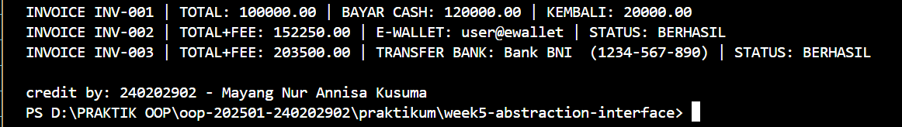

# Laporan Praktikum Minggu 5
Topik: [Abstraction (Abstract Class & Interface)]

## Identitas
- Nama  : [Mayang Nur Annisa Kusuma]
- NIM   : [240202902]
- Kelas : [3IKRB]

---

## Tujuan
1. Mahasiswa mampu menjelaskan perbedaan abstract class dan interface.
2. Mahasiswa mampu mendesain abstract class dengan method abstrak sesuai kebutuhan kasus.
3. Mahasiswa mampu membuat interface dan mengimplementasikannya pada class.
4. Mahasiswa mampu menerapkan multiple inheritance melalui interface pada rancangan kelas.
5. Mahasiswa mampu mendokumentasikan kode (komentar kelas/method, README singkat pada folder minggu).

---

## Dasar Teori
Abstraksi adalah proses menyederhanakan kompleksitas dengan menampilkan elemen penting dan menyembunyikan detail implementasi.
   a. Abstract class: tidak dapat diinstansiasi, dapat memiliki method abstrak (tanpa badan) dan non-abstrak. Dapat menyimpan state (field).
   b. Interface: kumpulan kontrak (method tanpa implementasi konkret). Sejak Java 8 mendukung default method. Mendukung multiple inheritance (class dapat mengimplementasikan banyak interface).
   c. Gunakan abstract class bila ada shared state dan perilaku dasar; gunakan interface untuk mendefinisikan kemampuan/kontrak lintas hierarki.
Dalam konteks Agri-POS, Pembayaran dapat dimodelkan sebagai abstract class dengan method abstrak prosesPembayaran() dan biaya(). Implementasi konkritnya: Cash dan EWallet. Kemudian, interface seperti Validatable (mis. verifikasi OTP) dan Receiptable (mencetak bukti) dapat diimplementasikan oleh jenis pembayaran yang relevan.

---

## Langkah Praktikum
1. Abstract Class – Pembayaran
   - Buat Pembayaran (abstract) dengan field invoiceNo, total dan method:
      a. double biaya() (abstrak) → biaya tambahan (fee).
      b. boolean prosesPembayaran() (abstrak) → mengembalikan status berhasil/gagal.
      c. double totalBayar() (konkrit) → return total + biaya();.

2. Subclass Konkret
   a. Cash → biaya = 0, proses = selalu berhasil jika tunai >= totalBayar().
   b. EWallet → biaya = 1.5% dari total; proses = membutuhkan validasi.

3. Interface
   a. Validatable → boolean validasi(); (contoh: OTP).
   b. Receiptable → String cetakStruk();

4. Multiple Inheritance via Interface
   a. EWallet mengimplementasikan dua interface: Validatable, Receiptable.
   b. Cash setidaknya mengimplementasikan Receiptable.

5. Main Class
   a. Buat MainAbstraction.java untuk mendemonstrasikan pemakaian Pembayaran (polimorfik).
   b. Tampilkan hasil proses dan struk. Di akhir, panggil CreditBy.print("[NIM]", "[Nama]").

6. Commit dan Push
   - Commit dengan pesan: week5-abstraction-interface.

---

## Kode Program
Tuliskan kode utama yang dibuat, contoh:  

1. Receiptable
```
Produk p1 = new Produk("BNH-001", "Benih Padi", 25000, 100);
System.out.println(p1.getNama());
```
2. Validatable
```
package com.upb.agripos.model.kontrak;

public interface Validatable {
    boolean validasi(); // misal validasi OTP/ PIN
}
```
3. Cash
```
package com.upb.agripos.model.pembayaran;

import com.upb.agripos.model.kontrak.Receiptable;

public class Cash extends Pembayaran implements Receiptable {
    private double tunai;

    public Cash(String invoiceNo, double total, double tunai) {
        super(invoiceNo, total);
        this.tunai = tunai;
    }

    @Override
    public double biaya() {
        return 0.0;
    }

    @Override
    public boolean prosesPembayaran() {
        return tunai >= totalBayar(); // sederhana: cukup uang tunai
    }

    @Override
    public String cetakStruk() {
        return String.format("INVOICE %s | TOTAL: %.2f | BAYAR CASH: %.2f | KEMBALI: %.2f",
                invoiceNo, totalBayar(), tunai, Math.max(0, tunai - totalBayar()));
    }
}
```
4. EWallet
```
package com.upb.agripos.model.pembayaran;

import com.upb.agripos.model.kontrak.Validatable;
import com.upb.agripos.model.kontrak.Receiptable;

public class EWallet extends Pembayaran implements Validatable, Receiptable {
    private String akun;
    private String otp; // sederhana untuk simulasi

    public EWallet(String invoiceNo, double total, String akun, String otp) {
        super(invoiceNo, total);
        this.akun = akun;
        this.otp = otp;
    }

    @Override
    public double biaya() {
        return total * 0.015; // 1.5% fee
    }

    @Override
    public boolean validasi() {
        return otp != null && otp.length() == 6; // contoh validasi sederhana
    }

    @Override
    public boolean prosesPembayaran() {
        return validasi(); // jika validasi lolos, anggap berhasil
    }

    @Override
    public String cetakStruk() {
        return String.format("INVOICE %s | TOTAL+FEE: %.2f | E-WALLET: %s | STATUS: %s",
                invoiceNo, totalBayar(), akun, prosesPembayaran() ? "BERHASIL" : "GAGAL");
    }
}
```
5. Pembayaran
```
package com.upb.agripos.model.pembayaran;

public abstract class Pembayaran {
    protected String invoiceNo;
    protected double total;

    public Pembayaran(String invoiceNo, double total) {
        this.invoiceNo = invoiceNo;
        this.total = total;
    }

    public abstract double biaya();               // fee/biaya tambahan
    public abstract boolean prosesPembayaran();   // proses spesifik tiap metode

    public double totalBayar() {
        return total + biaya();
    }

    public String getInvoiceNo() { return invoiceNo; }
    public double getTotal() { return total; }
}
```
6. Transfer Bank
```
package com.upb.agripos.model.pembayaran;


import com.upb.agripos.model.kontrak.Validatable;
import com.upb.agripos.model.pembayaran.Pembayaran;
import com.upb.agripos.model.kontrak.Receiptable;

public class TransferBank extends Pembayaran implements Validatable, Receiptable {
    private String rekeningTujuan;
    private String token; // kode keamanan 8 digit

    public TransferBank(String invoiceNo, double total, String rekeningTujuan, String token) {
        super(invoiceNo, total);
        this.rekeningTujuan = rekeningTujuan;
        this.token = token;
    }

    @Override
    public double biaya() {
        return 3500; // biaya tetap transfer bank
    }

    @Override
    public boolean validasi() {
        return token != null && token.length() == 8; // token harus 8 digit
    }

    @Override
    public boolean prosesPembayaran() {
        return validasi();
    }

    @Override
    public String cetakStruk() {
        return String.format("INVOICE %s | TOTAL+FEE: %.2f | TRANSFER BANK: Bank BNI  (%s) | STATUS: %s",
                invoiceNo, totalBayar(), rekeningTujuan,
                prosesPembayaran() ? "BERHASIL" : "GAGAL");
    }
}
```
7. CreditBy
```
package com.upb.agripos.util;

public class CreditBy {
    public static void print(String nim, String nama) {
        System.out.println("\ncredit by: " + nim + " - " + nama);
    }
}
```
8. Main Abstraction
```
package com.upb.agripos;

import com.upb.agripos.model.pembayaran.*;
import com.upb.agripos.model.kontrak.*;
import com.upb.agripos.util.CreditBy;

public class MainAbstraction {
    public static void main(String[] args) {

        Pembayaran cash = new Cash("INV-001", 100000, 120000);
        Pembayaran ew = new EWallet("INV-002", 150000, "user@ewallet", "123456");
        Pembayaran tf = new TransferBank("INV-003", 200000, "1234-567-890", "87654321");

        System.out.println(((Receiptable) cash).cetakStruk());
        System.out.println(((Receiptable) ew).cetakStruk());
        System.out.println(((Receiptable) tf).cetakStruk());

        CreditBy.print("240202902", "Mayang Nur Annisa Kusuma");
    }
}

```
---

## Hasil Eksekusi 


---

## Analisis
1. Jelaskan bagaimana kode berjalan.
    Jawaban: Program dimulai dari MainAbstraction.java dengan membuat objek Cash dan EWallet menggunakan referensi abstract class Pembayaran.
    Saat method cetakStruk() dipanggil, Java menjalankan implementasi sesuai objek aslinya (Cash atau EWallet).
    Perhitungan biaya dilakukan melalui method abstrak biaya() yang dioverride, sedangkan totalBayar() menggunakan implementasi dari abstract class.
    Pada EWallet, proses pembayaran bergantung pada hasil validasi() dari interface Validatable.
2. Apa perbedaan pendekatan minggu ini dibanding minggu sebelumnya.
    Jawaban: Pada minggu polymorphism, fokus utama adalah satu method dengan banyak perilaku melalui overriding.
    Pada minggu ini, pendekatan diperluas dengan abstraksi, yaitu:
        a. Menggunakan abstract class untuk mendefinisikan kerangka umum.
        b. Menggunakan interface untuk mendefinisikan kontrak kemampuan.
        c. Menerapkan multiple inheritance melalui interface, yang tidak dibahas pada minggu sebelumnya.
3. Kendala yang dihadapi dan cara mengatasinya.
    Jawaban: Kendala yang sering muncul adalah:
        Kesalahan override method abstrak atau lupa mengimplementasikan method dari interface.
        Kebingungan membedakan kapan memakai abstract class dan interface.
    Cara mengatasinya:
        Memastikan semua method abstrak dan interface diimplementasikan dengan benar.
        Menggunakan prinsip:
            abstract class untuk shared state & behavior,
            interface untuk kontrak atau kemampuan tambahan.

---

## Kesimpulan
Bab ini membahas abstraksi dalam Java menggunakan abstract class dan interface.
Abstract class digunakan untuk menyimpan atribut dan perilaku umum, seperti pada Pembayaran, sedangkan interface digunakan sebagai kontrak kemampuan yang dapat diimplementasikan oleh banyak kelas.

Penggunaan interface memungkinkan multiple inheritance secara aman di Java. Melalui contoh Agri-POS, terlihat bahwa abstraksi dan polimorfisme membuat kode lebih terstruktur, fleksibel, dan mudah dikembangkan.

---

## Quiz
1. Jelaskan perbedaan konsep dan penggunaan abstract class dan interface.
Jawaban: Abstract class digunakan sebagai kelas dasar yang dapat memiliki atribut, method  konkret, dan method abstrak. Abstract class cocok digunakan ketika beberapa kelas memiliki kesamaan struktur dan perilaku yang kuat.

Interface digunakan untuk mendefinisikan kontrak perilaku yang harus diimplementasikan oleh kelas lain tanpa menyertakan detail implementasi. Interface cocok digunakan ketika beberapa kelas tidak memiliki hubungan pewarisan langsung, tetapi harus memiliki kemampuan atau fungsi yang sama.
2. Mengapa multiple inheritance lebih aman dilakukan dengan interface pada Java?
Jawaban: Multiple inheritance lebih aman dilakukan dengan interface karena interface tidak memiliki implementasi method (atau hanya default method yang terkontrol), sehingga menghindari konflik implementasi yang dikenal sebagai diamond problem. Dengan interface, satu kelas dapat mengimplementasikan banyak interface tanpa menimbulkan ambiguitas pewarisan method, sehingga desain program menjadi lebih aman dan terstruktur.
3. Pada contoh Agri-POS, bagian mana yang paling tepat menjadi abstract class dan mana yang menjadi interface? Jelaskan alasannya.
Jawaban: Pada sistem Agri-POS, kelas Pembayaran paling tepat dijadikan abstract class karena memiliki atribut dan perilaku umum yang diwariskan oleh metode pembayaran seperti Cash, EWallet, dan TransferBank. Sementara itu, Receiptable paling tepat dijadikan interface karena berfungsi sebagai kontrak yang mendefinisikan kemampuan mencetak struk, yang dapat dimiliki oleh berbagai jenis kelas pembayaran tanpa harus berada dalam satu hierarki pewarisan.
