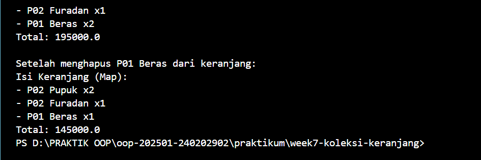
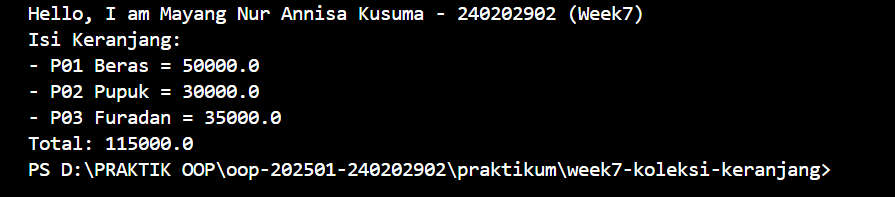

# Laporan Praktikum Minggu 7
Topik: ["Collections dan Implementasi Keranjang Belanja"]

## Identitas
- Nama  : [Mayang Nur Annisa Kusuma]
- NIM   : [240202902]
- Kelas : [3IKRB]

---

## Tujuan
1. Menjelaskan konsep collection dalam Java (List, Map, Set).
2. Menggunakan ArrayList untuk menyimpan dan mengelola objek.
3. Mengimplementasikan Map atau Set sesuai kebutuhan pengelolaan data.
4. Melakukan operasi dasar pada collection: tambah, hapus, dan hitung total.
5. Menganalisis efisiensi penggunaan collection dalam konteks sistem Agri-POS.

---

## Dasar Teori
Collections Framework
Java Collections Framework menyediakan struktur data untuk mengelola objek secara dinamis dan efisien.

Struktur utama:

List (implementasi: ArrayList) — Terurut, dapat menyimpan elemen duplikat.
Map (implementasi: HashMap) — Menyimpan pasangan key–value, akses cepat berdasarkan key.
Set (implementasi: HashSet) — Tidak menerima duplikat dan tidak mempertahankan urutan.
2. Studi Kasus: Keranjang Belanja Agri-POS
Keranjang belanja harus dapat:

Menambahkan produk
Menghapus produk
Menampilkan isi keranjang
Menghitung total nilai transaksi
Menangani jumlah (quantity) menggunakan Map
Kasus ini mencerminkan penggunaan struktur data dalam aplikasi nyata seperti POS.

---

## Langkah Praktikum
1. Langkah-langkah yang dilakukan (setup, coding, run).
    Menyiapkan struktur direktori praktikum sesuai template Week 7.
    Membuat package com.upb.agripos.
    Mengimplementasikan class Product untuk merepresentasikan data produk.
    Mengimplementasikan class ShoppingCart menggunakan ArrayList untuk menyimpan produk.
    Mengimplementasikan class ShoppingCartMap menggunakan HashMap untuk menyimpan produk dan quantity.
    Membuat class MainCart sebagai program utama.
    Menjalankan program dan mengamati hasil eksekusi.
    Mengambil screenshot hasil program sebagai bukti eksekusi.
    Melakukan commit dan push ke repository.
2. File/kode yang dibuat.
    Product.java → menyimpan atribut produk (kode, nama, harga)
    ShoppingCart.java → keranjang belanja berbasis ArrayList
    ShoppingCartMap.java → keranjang belanja berbasis Map dengan quantity
    MainCart.java → program utama untuk pengujian
    screenshots/hasil.png → screenshot hasil eksekusi
    laporan_week7.md → laporan praktikum
3. Commit message yang digunakan 
    week7-collections: implementasi shopping cart dengan ArrayList dan Map


---

## Kode Program
(Tuliskan kode utama yang dibuat, contoh:  

1. Main Cart
```
package com.upb.agripos;

public class MainCart {
    public static void main(String[] args) {

        System.out.println("Hello, I am Mayang Nur Annisa Kusuma - 240202902 (Week7)");

        Product p1 = new Product("P01", "Beras", 50000);
        Product p2 = new Product("P02", "Pupuk", 30000);
        Product p3 = new Product("P03", "Furadan", 35000);

        ShoppingCart cart = new ShoppingCart();
        cart.addProduct(p1);
        cart.addProduct(p2);
        cart.addProduct(p3);

        cart.printCart();
    }
}
```
2. Main Cart Map
```
package com.upb.agripos;

public class MainCartMap {
    public static void main(String[] args) {
        System.out.println("Hello, I am Mayang Nur Annisa Kusuma-240202902 (Week7)");

        Product p1 = new Product("P01", "Beras", 50000);
        Product p2 = new Product("P02", "Pupuk", 30000);
        Product p3 = new Product("P02", "Furadan", 35000);

        ShoppingCartMap cart = new ShoppingCartMap();
        cart.addProduct(p1);
        cart.addProduct(p1);
        cart.addProduct(p2);
        cart.addProduct(p2);
        cart.addProduct(p3);
        cart.printCart();

        System.out.println("\nSetelah menghapus " + p1.getCode() + " " + p1.getName() + " dari keranjang:");
        cart.removeProduct(p1);
        cart.printCart();
    }
}
```
3. Product
```
package com.upb.agripos;

public class Product {
    private final String code;
    private final String name;
    private final double price;

    public Product(String code, String name, double price) {
        this.code = code;
        this.name = name;
        this.price = price;
    }

    public String getCode() { return code; }
    public String getName() { return name; }
    public double getPrice() { return price; }
}
```
4. Shopping Cart
```
package com.upb.agripos;

import java.util.ArrayList;

public class ShoppingCart {
    private final ArrayList<Product> items = new ArrayList<>();

    public void addProduct(Product p) { items.add(p); }
    public void removeProduct(Product p) { items.remove(p); }

    public double getTotal() {
        double sum = 0;
        for (Product p : items) {
            sum += p.getPrice();
        }
        return sum;
    }

    public void printCart() {
        System.out.println("Isi Keranjang:");
        for (Product p : items) {
            System.out.println("- " + p.getCode() + " " + p.getName() + " = " + p.getPrice());
        }
        System.out.println("Total: " + getTotal());
    }
}
```
5. Shopping Cart Map
```
package com.upb.agripos;

import java.util.HashMap;
import java.util.Map;

public class ShoppingCartMap {
    private final Map<Product, Integer> items = new HashMap<>();

    public void addProduct(Product p) { items.put(p, items.getOrDefault(p, 0) + 1); }

    public void removeProduct(Product p) {
        if (!items.containsKey(p)) return;
        int qty = items.get(p);
        if (qty > 1) items.put(p, qty - 1);
        else items.remove(p);
    }

    public double getTotal() {
        double total = 0;
        for (Map.Entry<Product, Integer> entry : items.entrySet()) {
            total += entry.getKey().getPrice() * entry.getValue();
        }
        return total;
    }

    public void printCart() {
        System.out.println("Isi Keranjang (Map):");
        for (Map.Entry<Product, Integer> e : items.entrySet()) {
            System.out.println("- " + e.getKey().getCode() + " " + e.getKey().getName() + " x" + e.getValue());
        }
        System.out.println("Total: " + getTotal());
    }
}
```
---

## Hasil Eksekusi


---

## Analisis
- Jelaskan bagaimana kode berjalan.
    Program dimulai dari class MainCart. Pada bagian main, sistem membuat beberapa objek Product yang berisi kode, nama, dan harga produk.
    Produk-produk tersebut kemudian ditambahkan ke dalam objek ShoppingCart menggunakan method addProduct().

    Class ShoppingCart menyimpan data produk dalam ArrayList, sehingga setiap produk yang ditambahkan akan masuk ke daftar keranjang.
    Method getTotal() melakukan iterasi pada seluruh isi ArrayList untuk menjumlahkan harga produk.
    Method printCart() menampilkan daftar produk beserta total harga.

    Pada implementasi alternatif ShoppingCartMap, produk disimpan sebagai key dan quantity sebagai value menggunakan HashMap. Total harga dihitung dengan mengalikan harga produk dan jumlahnya.
- Apa perbedaan pendekatan minggu ini dibanding minggu sebelumnya.
    Pada minggu sebelumnya, program lebih berfokus pada penggunaan class dan object dasar tanpa pengelolaan kumpulan data yang dinamis.
    Pada minggu ini, pendekatan menggunakan Java Collections Framework, sehingga data dapat disimpan, ditambah, dan dihapus secara dinamis.
    Penggunaan List dan Map membuat program lebih fleksibel dan mendekati implementasi sistem POS nyata.
- Kendala yang dihadapi dan cara mengatasinya.
    Kendala yang dihadapi adalah memahami perbedaan penggunaan ArrayList dan HashMap.
    Awalnya sulit menentukan kapan menggunakan List dan kapan menggunakan Map.
    Masalah ini diatasi dengan memahami kebutuhan data, di mana ArrayList cocok untuk data sederhana, sedangkan Map lebih cocok ketika membutuhkan pasangan data seperti produk dan jumlahnya.

---

## Kesimpulan
Dengan menggunakan Java Collections Framework, khususnya ArrayList dan Map, keranjang belanja dapat diimplementasikan secara lebih efisien dan fleksibel.
Pendekatan ini membuat sistem Agri-POS lebih terstruktur, mudah dikembangkan, dan mendukung pengelolaan data yang dinamis seperti pada aplikasi POS nyata.

---

## Quiz
1. Jelaskan perbedaan mendasar antara List, Map, dan Set.
    a. List: Menyimpan data secara berurutan dan memperbolehkan elemen duplikat.
    b. Map: Menyimpan data dalam pasangan key–value dan tidak memperbolehkan key duplikat.
    c. Set: Menyimpan data unik tanpa duplikasi dan tidak menjamin urutan.
2. Mengapa ArrayList cocok digunakan untuk keranjang belanja sederhana?
    Karena ArrayList mudah digunakan, mendukung penambahan dan penghapusan data secara dinamis, serta memungkinkan data duplikat. Hal ini sesuai dengan keranjang belanja sederhana yang hanya membutuhkan daftar produk.
3. Bagaimana struktur Set mencegah duplikasi data?
    Set menggunakan mekanisme pengecekan nilai (melalui equals() dan hashCode()) sehingga elemen yang sama tidak dapat ditambahkan lebih dari satu kali.
4. Kapan sebaiknya menggunakan Map dibandingkan List? Jelaskan dengan contoh.
    Map digunakan ketika data memiliki hubungan key–value, misalnya produk dan jumlahnya.
    Contoh: Dalam keranjang belanja dengan quantity, Map<Product, Integer> lebih efisien dibandingkan List<Product> karena tidak perlu menyimpan objek produk yang sama berulang kali.
