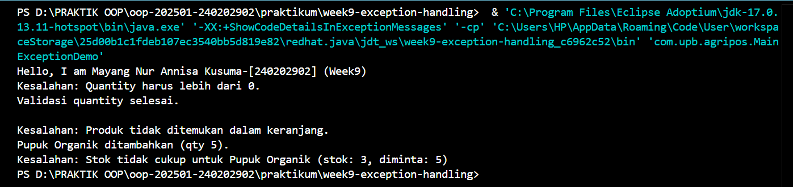

# Laporan Praktikum Minggu 9
Topik: ["Exception Handling, Custom Exception, dan Penerapan Design Pattern"]

## Identitas
- Nama  : [Mayang Nur Annisa Kusuma]
- NIM   : [240202902]
- Kelas : [3IKRB]

---

## Tujuan
1. Menjelaskan perbedaan antara error dan exception.
2. Mengimplementasikan try–catch–finally dengan tepat.
3. Membuat custom exception sesuai kebutuhan program.
4. Mengintegrasikan exception handling ke dalam aplikasi sederhana (kasus keranjang belanja).
5. (Opsional) Menerapkan design pattern sederhana (Singleton/MVC) dan unit testing dasar.

---

## Dasar Teori
(Tuliskan ringkasan teori singkat (3–5 poin) yang mendasari praktikum.  
Contoh:  
1. Class adalah blueprint dari objek.  
2. Object adalah instansiasi dari class.  
3. Enkapsulasi digunakan untuk menyembunyikan data.)

---

## Langkah Praktikum
Tuliskan Langkah-langkah dalam prakrikum, contoh:
1. Langkah-langkah yang dilakukan (setup, coding, run).  
2. File/kode yang dibuat.  
3. Commit message yang digunakan.

---

## Kode Program

1. Insufficient Stock Exception
```
package com.upb.agripos;

public class InsufficientStockException extends Exception {
    public InsufficientStockException(String msg) { super(msg); }
}
```
2. Invalid Quantity Exception
```
package com.upb.agripos;

public class InvalidQuantityException extends Exception {
    public InvalidQuantityException(String message) {
        super(message);
    }
}
```
3. Main Exception Demo
```
package com.upb.agripos;

public class MainExceptionDemo {

    public static void main(String[] args) {

        System.out.println("Hello, I am Mayang Nur Annisa Kusuma-[240202902] (Week9)");

        ShoppingCart cart = new ShoppingCart();
        Product pupuk = new Product("P01", "Pupuk Organik", 25000, 3);

        // 1. Invalid quantity
        try {
            cart.addProduct(pupuk, -1);
        } catch (InvalidQuantityException e) {
            System.out.println("Kesalahan: " + e.getMessage());
        } finally {
            System.out.println("Validasi quantity selesai.\n");
        }

        // 2. Remove product not in cart
        try {
            cart.removeProduct(pupuk);
        } catch (ProductNotFoundException e) {
            System.out.println("Kesalahan: " + e.getMessage());
        }

        // 3. Insufficient stock
        try {
            cart.addProduct(pupuk, 5);
            cart.checkout();
        } catch (Exception e) {
            System.out.println("Kesalahan: " + e.getMessage());
        }
    }
}
```
4. Product
```
package com.upb.agripos;

public class Product {

    private final String code;
    private final String name;
    private final double price;
    private int stock;

    public Product(String code, String name, double price, int stock) {
        this.code = code;
        this.name = name;
        this.price = price;
        this.stock = stock;
    }

    public String getCode() { return code; }
    public String getName() { return name; }
    public double getPrice() { return price; }
    public int getStock() { return stock; }

    public void reduceStock(int qty) {
        this.stock -= qty;
    }

    // penting untuk Map
    @Override
    public boolean equals(Object o) {
        if (this == o) return true;
        if (!(o instanceof Product)) return false;
        Product p = (Product) o;
        return code.equals(p.code);
    }

    @Override
    public int hashCode() {
        return code.hashCode();
    }
}
```
5. Product Not Found Exception
```
package com.upb.agripos;

public class ProductNotFoundException extends Exception {
    public ProductNotFoundException(String message) {
        super(message);
    }
}
```
6. Shopping Cart
```
package com.upb.agripos;

import java.util.HashMap;
import java.util.Map;

public class ShoppingCart {

    private final Map<Product, Integer> items = new HashMap<>();

    // tambahProduk
    public void addProduct(Product product, int qty)
            throws InvalidQuantityException {

        if (qty <= 0) {
            throw new InvalidQuantityException("Quantity harus lebih dari 0.");
        }

        items.put(product, items.getOrDefault(product, 0) + qty);
        System.out.println(product.getName() + " ditambahkan (qty " + qty + ").");
    }

    // hapusProduk
    public void removeProduct(Product product)
            throws ProductNotFoundException {

        if (!items.containsKey(product)) {
            throw new ProductNotFoundException(
                "Produk tidak ditemukan dalam keranjang."
            );
        }

        items.remove(product);
        System.out.println(product.getName() + " dihapus dari keranjang.");
    }

    // checkout
    public void checkout() throws InsufficientStockException {

        for (Map.Entry<Product, Integer> entry : items.entrySet()) {
            Product p = entry.getKey();
            int qty = entry.getValue();

            if (p.getStock() < qty) {
                throw new InsufficientStockException(
                    "Stok tidak cukup untuk " + p.getName() +
                    " (stok: " + p.getStock() + ", diminta: " + qty + ")"
                );
            }
        }

        // pengurangan stok
        for (Map.Entry<Product, Integer> entry : items.entrySet()) {
            entry.getKey().reduceStock(entry.getValue());
        }

        System.out.println("Checkout berhasil. Stok diperbarui.");
    }
}
```

---

## Hasil Eksekusi


---

## Analisis
- Jelaskan bagaimana kode berjalan.
   Alur eksekusi program dimulai dari class MainExceptionDemo sebagai controller utama.
   Program membuat objek Product dan ShoppingCart.
   Saat kasir menambahkan produk ke keranjang (addProduct), sistem memvalidasi jumlah pembelian:
   Jika jumlah ≤ 0, maka InvalidQuantityException dilempar.
   Saat menghapus produk (removeProduct), sistem memeriksa apakah produk ada di keranjang:
   Jika tidak ditemukan, ProductNotFoundException dilempar.
   Pada proses checkout, sistem memeriksa apakah stok mencukupi:
   Jika stok kurang, InsufficientStockException dilempar.
   Semua exception tersebut ditangani di blok try–catch pada MainExceptionDemo, sehingga program tetap berjalan dan menampilkan pesan kesalahan yang informatif.
   Dengan mekanisme ini, alur program tetap aman dan kesalahan bisnis dapat ditangani tanpa menghentikan aplikasi.
- Apa perbedaan pendekatan minggu ini dibanding minggu sebelumnya.
   Perbedaan utama pendekatan pada minggu ini dibanding minggu sebelumnya adalah fokus pembelajaran:
   Minggu sebelumnya menitikberatkan pada desain dan perancangan sistem (UML, SOLID, arsitektur aplikasi) tanpa implementasi logika detail.
   Minggu ini berfokus pada implementasi kode nyata, khususnya:
      penanganan kesalahan menggunakan exception,
      pembuatan custom exception sesuai kebutuhan bisnis,
      integrasi exception handling ke dalam alur program.
   Dengan demikian, minggu ini lebih menekankan aspek runtime behavior dan robustness kode, bukan hanya struktur desain.
- Kendala yang dihadapi dan cara mengatasinya.
   1. Menentukan jenis exception yang tepat
   Awalnya sulit membedakan kapan harus menggunakan exception bawaan dan kapan perlu custom exception.
   Solusi:
   Mengidentifikasi kesalahan yang berasal dari aturan bisnis, lalu membuat custom exception khusus agar lebih jelas dan terstruktur.

   2. Program berhenti saat exception tidak ditangani
   Exception yang tidak ditangkap menyebabkan program berhenti secara tiba-tiba.
   Solusi:
   Menggunakan blok try–catch pada MainExceptionDemo untuk menangani setiap kemungkinan exception.

3. Alur program menjadi tidak jelas saat banyak validasi
   Banyaknya validasi membuat kode sulit dibaca.
   Solusi:
   Memisahkan logika validasi ke dalam method dan menggunakan custom exception agar alur kode tetap rapi dan mudah dipahami.


---

## Kesimpulan
Pada praktikum Week 9, telah berhasil diterapkan konsep exception handling menggunakan struktur try–catch–finally serta pembuatan custom exception pada studi kasus keranjang belanja (ShoppingCart) Agri-POS.
Penerapan custom exception seperti InvalidQuantityException, ProductNotFoundException, dan InsufficientStockException membuat sistem lebih robust, mudah dipahami, dan mampu menangani kesalahan sesuai dengan aturan bisnis POS.
Dengan pendekatan ini, kesalahan dapat ditangani secara terkontrol tanpa menyebabkan program berhenti secara tiba-tiba, sehingga meningkatkan kualitas dan keandalan aplikasi.

---

## Quiz
1. Jelaskan perbedaan error dan exception.
   Jawaban: Error adalah kesalahan serius yang terjadi pada level sistem dan tidak dapat ditangani oleh program, sehingga biasanya menyebabkan aplikasi berhenti. Error umumnya terjadi karena keterbatasan resource atau masalah fatal pada JVM.

   Exception adalah kondisi tidak normal yang terjadi saat program berjalan tetapi masih dapat ditangani oleh program menggunakan mekanisme try–catch.
   Contoh:
   Error: OutOfMemoryError
   Exception: InvalidQuantityException, InsufficientStockException
2. Apa fungsi finally dalam blok try–catch–finally?
   Jawaban:Blok finally berfungsi untuk mengeksekusi kode yang selalu dijalankan, baik:
      a. terjadi exception atau tidak,
      b. exception tertangkap atau tidak tertangkap.
   finally biasanya digunakan untuk:
      a. membersihkan resource,
      b. menutup koneksi,
      c. memastikan proses akhir tetap berjalan.
   Contoh dalam POS:
   Menutup transaksi, mereset status keranjang, atau menutup koneksi database setelah checkout.
3. Mengapa custom exception diperlukan?
   Jawaban: Custom exception diperlukan untuk:
      Mewakili aturan bisnis spesifik yang tidak disediakan oleh exception bawaan Java.
      Membuat kode lebih jelas, terstruktur, dan mudah dipahami.
      Memudahkan penanganan error yang lebih spesifik dan informatif.
   Dengan custom exception, program POS dapat membedakan kesalahan input, stok, dan logika bisnis tanpa menggunakan exception umum seperti Exception atau RuntimeException.
4. Berikan contoh kasus bisnis dalam POS yang membutuhkan custom exception.
   Jawaban: Beberapa contoh kasus bisnis dalam sistem POS (Agri-POS):

   Jumlah pembelian tidak valid
   → InvalidQuantityException
   Digunakan ketika kasir memasukkan jumlah ≤ 0.

   Produk tidak ditemukan dalam keranjang
   → ProductNotFoundException
   Digunakan saat kasir mencoba menghapus produk yang belum ditambahkan.

   Stok produk tidak mencukupi saat checkout
   → InsufficientStockException
   Digunakan ketika stok produk lebih kecil dari jumlah pembelian.

   Custom exception ini membantu sistem memberikan pesan kesalahan yang jelas dan mencegah transaksi yang tidak valid.
